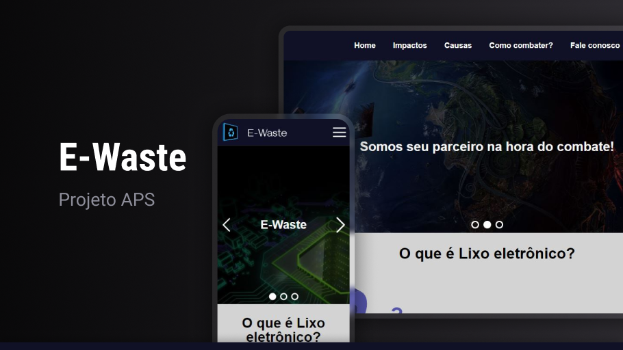

<h1 align="center"> E-Waste </h1>

  

## 💻 Projeto

E-Waste é um site totalmente responsivo desenvolvido na Unip durante as aulas de Programação Web Responsiva.

- [Acesse o projeto finalizado, online](https://oliveiravitor32.github.io/E-Waste/)

## 🚀 Tecnologias

Esse projeto foi desenvolvido com as seguintes tecnologias:

- HTML e CSS
- JavaScript
- Git e Github
- Figma

## :handshake: Contribuidores

<table>
  <tr>
    <td align="center">
      <a href="https://github.com/Guiswer">
         
        
          <strong>Guilherme Leandro</strong>
        
      </a> 
    </td>  
    <td align="center">
      <a href="https://github.com/helen-silv4">
         
        
          <strong>Helen Silva</strong>
        
      </a> 
    </td>
    <td align="center">
      <a href="https://github.com/oliveiravitor32">
         
        
          <strong>Vitor Oliveira</strong>
        
      </a> 
    </td> 
  </tr>
</table>  

## :memo: Licença

Esse projeto está sob a licença MIT.
